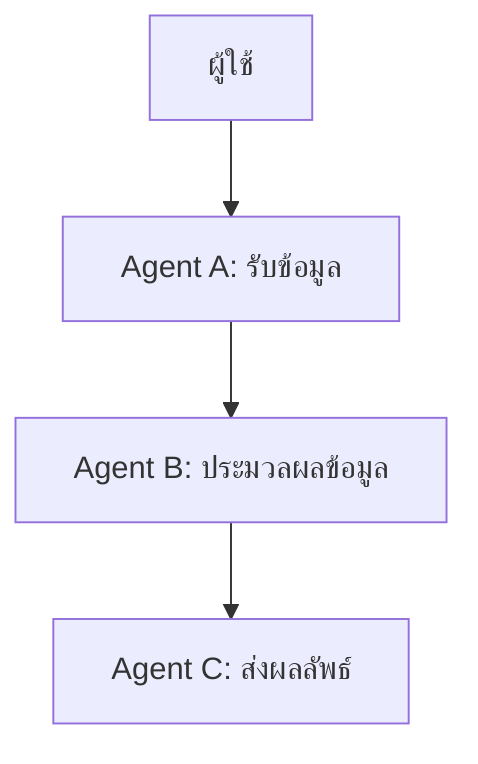

# การทดลอง Python-a2a

โปรเจคนี้เป็นการทดลองใช้งานไลบรารี [python-a2a](https://github.com/themanojdesai/python-a2a) เพื่อการเรียนรู้และพัฒนาทักษะการเขียนโปรแกรมสำหรับนักศึกษา Big Data ที่มหาวิทยาลัยเทคโนโลยีราชมงคลธัญบุรี (RMUTT) โดยขอขอบคุณผู้สร้างไลบรารี themanojdesai และ Google ADK Agent ที่เป็นแรงบันดาลใจในการพัฒนาโปรเจคนี้

## สารบัญ
1. [การติดตั้ง (Installation)](#การติดตั้ง-installation)
2. [การกำหนด Workflow ที่ซับซ้อนด้วยหลาย Agent](#การกำหนด-workflow-ที่ซับซ้อนด้วยหลาย-agent-define-complex-workflows-with-multiple-agents)
3. [การเชื่อมต่อกับ LangChain](#การเชื่อมต่อกับ-langchain-langchain-integration)
4. [การปรับจูน Prompt และรายละเอียดด้านเทคนิค](#การปรับจูน-prompt-และรายละเอียดด้านเทคนิค)
5. [สเปคที่ใช้งานกับ LangChain และแนะนำโมเดล](#สเปคที่ใช้งานกับ-langchain-และแนะนำโมเดล)

## การติดตั้ง (Installation)
1. ตรวจสอบให้แน่ใจว่าคุณได้ติดตั้ง Python เวอร์ชัน 3.8 ขึ้นไป
2. คลอนโปรเจคนี้จาก GitHub:
   ```bash
   git clone https://github.com/themanojdesai/python-a2a
   ```
3. ติดตั้งไลบรารีที่จำเป็น:
   ```bash
   pip install -r requirements.txt
   ```
4. รันเซิร์ฟเวอร์:
   ```bash
   python 01_Create\ a\ Simple\ A2A\ Agent\ with\ Skills.py
   ```

## การกำหนด Workflow ที่ซับซ้อนด้วยหลาย Agent (Define Complex Workflows with Multiple Agents)

ไลบรารี python-a2a ช่วยให้คุณสามารถสร้าง Workflow ที่ซับซ้อนโดยการเชื่อมต่อหลาย Agent เข้าด้วยกัน ตัวอย่างเช่น:

### แผนผัง Workflow


### รายละเอียด
- **Agent A**: รับข้อมูลจากผู้ใช้ เช่น คำถามเกี่ยวกับสภาพอากาศ หรือข้อมูลที่ต้องการวิเคราะห์
- **Agent B**: ประมวลผลข้อมูล เช่น การดึงข้อมูลจาก API การวิเคราะห์ข้อความ หรือการคำนวณ
- **Agent C**: ส่งผลลัพธ์กลับไปยังผู้ใช้ในรูปแบบที่เข้าใจง่าย เช่น ข้อความหรือกราฟ

### แนวทางการต่อยอด

1. **ระบบช่วยเหลือการเรียน**
   - แนวคิด: สร้าง Workflow ที่ช่วยตอบคำถามเกี่ยวกับเนื้อหาวิชาเรียน เช่น การอธิบายแนวคิดทางคณิตศาสตร์ หรือการแนะนำแหล่งข้อมูลเพิ่มเติม
   - แผนผัง:
     ```mermaid
     graph TD
         A[ผู้ใช้] --> B[Agent A: รับคำถาม]
         B --> C[Agent B: ค้นหาข้อมูล]
         C --> D[Agent C: ส่งคำตอบ]
     ```
   - มุมมองนักศึกษา: "ระบบนี้ช่วยให้เราเข้าใจเนื้อหาที่ซับซ้อนได้ง่ายขึ้น และลดเวลาในการค้นหาข้อมูลเอง"

2. **การวิเคราะห์ข้อมูลโครงการ**
   - แนวคิด: ใช้ Workflow เพื่อรวบรวมและวิเคราะห์ข้อมูลสำหรับโครงการวิจัย เช่น การวิเคราะห์ข้อมูลเชิงสถิติ หรือการสร้างรายงานอัตโนมัติ
   - แผนผัง:
     ```mermaid
     graph TD
         A[ผู้ใช้] --> B[Agent A: รับข้อมูลดิบ]
         B --> C[Agent B: วิเคราะห์ข้อมูล]
         C --> D[Agent C: สร้างรายงาน]
     ```
   - มุมมองนักศึกษา: "ช่วยลดความซับซ้อนในการวิเคราะห์ข้อมูล และทำให้เราสามารถโฟกัสกับการตีความผลลัพธ์ได้มากขึ้น"

3. **การจัดการกิจกรรม**
   - แนวคิด: พัฒนา Workflow ที่ช่วยจัดการกิจกรรมของนักศึกษา เช่น การแจ้งเตือนกำหนดส่งงาน การจัดการตารางเรียน หรือการวางแผนโครงการ
   - แผนผัง:
     ```mermaid
     graph TD
         A[ผู้ใช้] --> B[Agent A: รับข้อมูลกิจกรรม]
         B --> C[Agent B: สร้างตารางเวลา]
         C --> D[Agent C: แจ้งเตือน]
     ```
   - มุมมองนักศึกษา: "ระบบนี้ช่วยให้เราจัดการเวลาได้ดีขึ้น และไม่พลาดกำหนดส่งงานสำคัญ"

4. **การสร้างระบบแนะนำ**
   - แนวคิด: ใช้ Workflow เพื่อสร้างระบบแนะนำ เช่น การแนะนำคอร์สเรียนออนไลน์ หรือการแนะนำหนังสือในห้องสมุด
   - แผนผัง:
     ```mermaid
     graph TD
         A[ผู้ใช้] --> B[Agent A: รับความสนใจ]
         B --> C[Agent B: ค้นหาคอร์ส/หนังสือ]
         C --> D[Agent C: ส่งคำแนะนำ]
     ```
   - มุมมองนักศึกษา: "ช่วยให้เราได้พบกับแหล่งข้อมูลที่ตรงกับความสนใจและความต้องการของเราได้ง่ายขึ้น"

## การเชื่อมต่อกับ LangChain (LangChain Integration)

ไลบรารีนี้ยังสามารถเชื่อมต่อกับ LangChain เพื่อเพิ่มความสามารถในการประมวลผลภาษาธรรมชาติ (NLP) และการจัดการข้อมูลขนาดใหญ่ ตัวอย่างเช่น:

- **การสร้างโมเดลการสนทนา**: นักศึกษาสามารถพัฒนาแชทบอทเพื่อช่วยตอบคำถามเกี่ยวกับการเรียน เช่น การค้นหาข้อมูลวิชาเรียน ตารางเรียน หรือการแนะนำแหล่งข้อมูลเพิ่มเติม
- **การวิเคราะห์ข้อความ**: ใช้สำหรับวิเคราะห์ความคิดเห็นในโซเชียลมีเดีย เช่น การวิเคราะห์ความรู้สึก (Sentiment Analysis) ของโพสต์หรือความคิดเห็นที่เกี่ยวข้องกับโครงการวิจัย
- **การจัดการข้อมูลเชิงความสัมพันธ์**: สร้างระบบที่ช่วยจัดการข้อมูลนักศึกษา เช่น การเชื่อมโยงข้อมูลผลการเรียนกับกิจกรรมที่เข้าร่วม เพื่อวิเคราะห์ความสัมพันธ์ระหว่างการเรียนและกิจกรรม

### ตัวอย่างการใช้งาน LangChain

LangChain ช่วยให้นักพัฒนาสามารถสร้าง Workflow ที่ซับซ้อนสำหรับการประมวลผลภาษาธรรมชาติได้ง่ายขึ้น ตัวอย่างเช่น การสร้างแชทบอทที่สามารถตอบคำถามเกี่ยวกับวิชาเรียน:

```python
from langchain.chains import ConversationChain
from langchain.llms import OpenAI

# สร้างโมเดล LLM
llm = OpenAI(temperature=0.7)

# สร้าง Conversation Chain
conversation = ConversationChain(llm=llm)

# เริ่มต้นการสนทนา
response = conversation.run("ช่วยอธิบายแนวคิดของ Big Data ให้หน่อย")
print(response)
```

ในตัวอย่างนี้ เราใช้ LangChain เพื่อสร้าง Conversation Chain ที่สามารถตอบคำถามเกี่ยวกับ Big Data ได้โดยใช้โมเดล OpenAI นักศึกษาสามารถปรับแต่งโมเดลและคำถามให้เหมาะสมกับเนื้อหาที่ต้องการศึกษาได้

LangChain ยังสามารถใช้ร่วมกับ Workflow ที่ซับซ้อนเพื่อเพิ่มประสิทธิภาพในการจัดการข้อมูล ตัวอย่างเช่น การวิเคราะห์ความคิดเห็นในโซเชียลมีเดีย:

```python
from langchain.chains import LLMChain
from langchain.prompts import PromptTemplate
from langchain.llms import OpenAI

# สร้าง Prompt Template
prompt = PromptTemplate(
    input_variables=["text"],
    template="วิเคราะห์ความรู้สึกของข้อความนี้: {text}"
)

# สร้าง LLM Chain
llm = OpenAI(temperature=0.5)
chain = LLMChain(llm=llm, prompt=prompt)

# วิเคราะห์ข้อความ
result = chain.run("ฉันชอบเรียนวิชา Big Data มาก")
print(result)
```

ในตัวอย่างนี้ LangChain ถูกใช้เพื่อวิเคราะห์ความรู้สึกของข้อความที่เกี่ยวข้องกับวิชา Big Data ซึ่งสามารถนำไปใช้ในโครงการวิจัยหรือการวิเคราะห์ข้อมูลเชิงลึกได้

LangChain ยังสามารถนำไปใช้ในระบบแนะนำ เช่น การแนะนำคอร์สเรียนออนไลน์หรือหนังสือในห้องสมุด โดยการปรับแต่ง Workflow และโมเดลให้เหมาะสมกับความต้องการของผู้ใช้

## การปรับจูน Prompt และรายละเอียดด้านเทคนิค

LangChain ช่วยให้นักพัฒนาสามารถปรับแต่ง Prompt เพื่อให้ได้ผลลัพธ์ที่ตรงกับความต้องการของผู้ใช้มากขึ้น การปรับจูน Prompt เป็นกระบวนการที่สำคัญในการเพิ่มประสิทธิภาพของโมเดล ตัวอย่างเช่น:

#### การปรับจูน Prompt
1. **ระบุคำถามให้ชัดเจน**: การใช้คำถามที่ชัดเจนและเจาะจงช่วยให้โมเดลสามารถตอบคำถามได้ตรงประเด็นมากขึ้น เช่น:
   ```python
   prompt = PromptTemplate(
       input_variables=["text"],
       template="โปรดอธิบายแนวคิดของ {text} ในเชิงลึก"
   )
   ```
2. **ใช้ตัวอย่างใน Prompt**: การเพิ่มตัวอย่างใน Prompt ช่วยให้โมเดลเข้าใจบริบทได้ดีขึ้น เช่น:
   ```python
   prompt = PromptTemplate(
       input_variables=["text"],
       template="ตัวอย่าง: Big Data คือการจัดการข้อมูลขนาดใหญ่\nโปรดอธิบายเพิ่มเติมเกี่ยวกับ {text}"
   )
   ```
3. **ปรับอุณหภูมิ (Temperature)**: การปรับค่า Temperature ของโมเดลช่วยควบคุมความสร้างสรรค์ของคำตอบ ค่า Temperature ต่ำจะให้คำตอบที่คาดเดาได้มากขึ้น ในขณะที่ค่าที่สูงจะเพิ่มความหลากหลายของคำตอบ:
   ```python
   llm = OpenAI(temperature=0.3)  # คำตอบที่คาดเดาได้
   llm = OpenAI(temperature=0.9)  # คำตอบที่สร้างสรรค์
   ```

#### รายละเอียดด้านเทคนิค
- **การจัดการ Context**: LangChain รองรับการจัดการ Context ในการสนทนา เช่น การเก็บประวัติการสนทนาเพื่อให้โมเดลสามารถตอบคำถามต่อเนื่องได้:
  ```python
  from langchain.memory import ConversationBufferMemory

  memory = ConversationBufferMemory()
  conversation = ConversationChain(llm=llm, memory=memory)
  response = conversation.run("ช่วยอธิบายแนวคิดของ AI")
  print(response)
  ```
- **การเชื่อมต่อ API อื่นๆ**: LangChain สามารถเชื่อมต่อกับ API ภายนอกเพื่อดึงข้อมูลเพิ่มเติม เช่น การเชื่อมต่อกับฐานข้อมูลหรือ API ของ OpenWeatherMap:
  ```python
  from langchain.tools import Tool

  def fetch_weather(location):
      # ฟังก์ชันดึงข้อมูลสภาพอากาศ
      return f"สภาพอากาศใน {location} คือแดดออก"

  weather_tool = Tool(name="Weather", func=fetch_weather, description="ดึงข้อมูลสภาพอากาศ")
  ```
- **การปรับแต่งโมเดล**: นักพัฒนาสามารถปรับแต่งโมเดลเพิ่มเติม เช่น การฝึกโมเดลด้วยข้อมูลเฉพาะทางเพื่อเพิ่มความแม่นยำในบริบทที่ต้องการ

การปรับจูน Prompt และการใช้เทคนิคเหล่านี้ช่วยให้นักศึกษาสามารถสร้างระบบที่ตอบสนองความต้องการได้อย่างมีประสิทธิภาพและตรงกับบริบทที่ต้องการมากขึ้น

## สเปคที่ใช้งานกับ LangChain และแนะนำโมเดล

LangChain สามารถใช้งานได้กับคอมพิวเตอร์ที่มีสเปคต่ำ โดยการเลือกใช้โมเดลที่เหมาะสม เช่น:

### แนะนำโมเดลสำหรับคอมพิวเตอร์สเปคต่ำ
1. **OpenAI GPT-3.5 Turbo**: โมเดลนี้มีประสิทธิภาพสูงและใช้ทรัพยากรน้อยกว่า GPT-4 เหมาะสำหรับการพัฒนาแอปพลิเคชันที่ต้องการการตอบสนองรวดเร็ว
2. **Hugging Face DistilBERT**: โมเดลขนาดเล็กที่เหมาะสำหรับงานประมวลผลภาษาธรรมชาติ เช่น การวิเคราะห์ข้อความและการจัดหมวดหมู่
3. **Google T5-Small**: โมเดลขนาดเล็กที่สามารถใช้งานได้หลากหลาย เช่น การสรุปข้อความและการแปลภาษา

### เปรียบเทียบกับการใช้งาน VM ของ Microsoft
Microsoft Azure Virtual Machines (VM) เป็นอีกทางเลือกหนึ่งที่นักศึกษาสามารถใช้งานได้ โดยมีข้อดีและข้อเสียดังนี้:

| คุณสมบัติ                | คอมพิวเตอร์สเปคต่ำ                     | Microsoft Azure VM                  |
|--------------------------|---------------------------------------|-------------------------------------|
| **การตั้งค่า**            | ไม่ต้องตั้งค่าเพิ่มเติม                 | ต้องตั้งค่า VM และติดตั้งซอฟต์แวร์ |
| **ทรัพยากร**             | จำกัดตามสเปคเครื่อง                   | สามารถเลือกทรัพยากรได้ตามต้องการ  |
| **ค่าใช้จ่าย**            | ไม่มีค่าใช้จ่ายเพิ่มเติม                | มีค่าใช้จ่ายตามการใช้งาน           |
| **ความยืดหยุ่น**          | จำกัดตามฮาร์ดแวร์                     | ยืดหยุ่นและปรับขนาดได้            |
| **การเข้าถึง**            | ใช้งานได้ทันที                        | ต้องเชื่อมต่ออินเทอร์เน็ต          |

### คำแนะนำ
- สำหรับนักศึกษาที่มีคอมพิวเตอร์สเปคต่ำ: ควรเลือกใช้โมเดลขนาดเล็ก เช่น DistilBERT หรือ T5-Small และปรับ Workflow ให้เหมาะสม
- สำหรับงานที่ต้องการทรัพยากรสูง: ใช้ Microsoft Azure VM เพื่อเพิ่มประสิทธิภาพและความยืดหยุ่นในการพัฒนา

การเลือกใช้งานขึ้นอยู่กับความต้องการและทรัพยากรที่มีอยู่ นักศึกษาสามารถทดลองทั้งสองวิธีเพื่อหาวิธีที่เหมาะสมที่สุดสำหรับโครงการของตนเอง