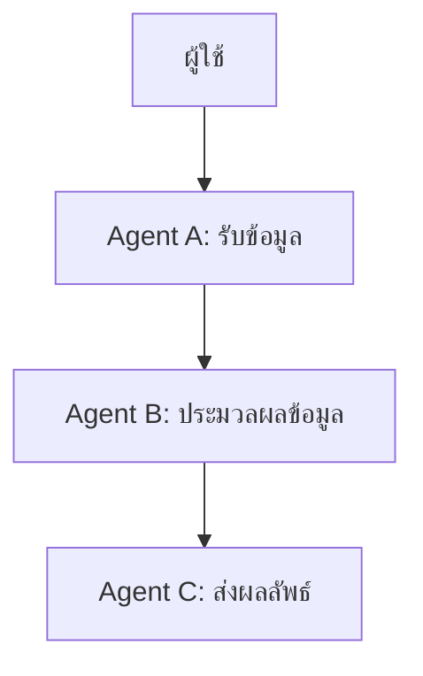

# การทดลอง Python-a2a

โปรเจคนี้เป็นการทดลองใช้งานไลบรารี [python-a2a](https://github.com/themanojdesai/python-a2a) เพื่อการเรียนรู้และพัฒนาทักษะการเขียนโปรแกรมสำหรับนักศึกษา Big Data ที่มหาวิทยาลัยเทคโนโลยีราชมงคลธัญบุรี (RMUTT) โดยขอขอบคุณผู้สร้างไลบรารี themanojdesai และ Google ADK Agent ที่เป็นแรงบันดาลใจในการพัฒนาโปรเจคนี้

## การติดตั้ง (Installation)
1. ตรวจสอบให้แน่ใจว่าคุณได้ติดตั้ง Python เวอร์ชัน 3.8 ขึ้นไป
2. คลอนโปรเจคนี้จาก GitHub:
   ```bash
   git clone https://github.com/themanojdesai/python-a2a
   ```
3. ติดตั้งไลบรารีที่จำเป็น:
   ```bash
   pip install -r requirements.txt
   ```
4. รันเซิร์ฟเวอร์:
   ```bash
   python 01_Create\ a\ Simple\ A2A\ Agent\ with\ Skills.py
   ```

## การกำหนด Workflow ที่ซับซ้อนด้วยหลาย Agent (Define Complex Workflows with Multiple Agents)

ไลบรารี python-a2a ช่วยให้คุณสามารถสร้าง Workflow ที่ซับซ้อนโดยการเชื่อมต่อหลาย Agent เข้าด้วยกัน ตัวอย่างเช่น:

### แผนผัง Workflow


### รายละเอียด
- **Agent A**: รับข้อมูลจากผู้ใช้ เช่น คำถามเกี่ยวกับสภาพอากาศ หรือข้อมูลที่ต้องการวิเคราะห์
- **Agent B**: ประมวลผลข้อมูล เช่น การดึงข้อมูลจาก API การวิเคราะห์ข้อความ หรือการคำนวณ
- **Agent C**: ส่งผลลัพธ์กลับไปยังผู้ใช้ในรูปแบบที่เข้าใจง่าย เช่น ข้อความหรือกราฟ

### แนวทางการต่อยอด
1. **ระบบช่วยเหลือการเรียน**: นักศึกษาสามารถสร้าง Workflow ที่ช่วยตอบคำถามเกี่ยวกับเนื้อหาวิชาเรียน เช่น การอธิบายแนวคิดทางคณิตศาสตร์ หรือการแนะนำแหล่งข้อมูลเพิ่มเติม
2. **การวิเคราะห์ข้อมูลโครงการ**: ใช้ Workflow เพื่อรวบรวมและวิเคราะห์ข้อมูลสำหรับโครงการวิจัย เช่น การวิเคราะห์ข้อมูลเชิงสถิติ หรือการสร้างรายงานอัตโนมัติ
3. **การจัดการกิจกรรม**: พัฒนา Workflow ที่ช่วยจัดการกิจกรรมของนักศึกษา เช่น การแจ้งเตือนกำหนดส่งงาน การจัดการตารางเรียน หรือการวางแผนโครงการ
4. **การสร้างระบบแนะนำ**: ใช้ Workflow เพื่อสร้างระบบแนะนำ เช่น การแนะนำคอร์สเรียนออนไลน์ หรือการแนะนำหนังสือในห้องสมุด

### การนำไปใช้ในชีวิตจริง
- **การเรียนรู้แบบโต้ตอบ**: นักศึกษาสามารถใช้ Workflow เพื่อสร้างระบบที่ช่วยให้การเรียนรู้เป็นไปอย่างโต้ตอบ เช่น การถาม-ตอบแบบเรียลไทม์
- **การพัฒนาทักษะการเขียนโปรแกรม**: การสร้าง Workflow ช่วยให้นักศึกษาได้ฝึกทักษะการเขียนโปรแกรมและการแก้ปัญหา
- **การเตรียมตัวสำหรับการทำงาน**: Workflow ที่ซับซ้อนช่วยให้นักศึกษาเข้าใจการทำงานของระบบที่ใช้ในองค์กร เช่น ระบบ CRM หรือระบบจัดการข้อมูลลูกค้า

Workflow เหล่านี้สามารถปรับแต่งให้เหมาะสมกับความต้องการของนักศึกษาและช่วยเพิ่มประสิทธิภาพในการเรียนรู้และการทำงานได้อย่างมีประสิทธิภาพ

## การเชื่อมต่อกับ LangChain (LangChain Integration)
ไลบรารีนี้ยังสามารถเชื่อมต่อกับ LangChain เพื่อเพิ่มความสามารถในการประมวลผลภาษาธรรมชาติ (NLP) และการจัดการข้อมูลขนาดใหญ่ ตัวอย่างเช่น:

- **การสร้างโมเดลการสนทนา**: นักศึกษาสามารถพัฒนาแชทบอทเพื่อช่วยตอบคำถามเกี่ยวกับการเรียน เช่น การค้นหาข้อมูลวิชาเรียน ตารางเรียน หรือการแนะนำแหล่งข้อมูลเพิ่มเติม
- **การวิเคราะห์ข้อความ**: ใช้สำหรับวิเคราะห์ความคิดเห็นในโซเชียลมีเดีย เช่น การวิเคราะห์ความรู้สึก (Sentiment Analysis) ของโพสต์หรือความคิดเห็นที่เกี่ยวข้องกับโครงการวิจัย
- **การจัดการข้อมูลเชิงความสัมพันธ์**: สร้างระบบที่ช่วยจัดการข้อมูลนักศึกษา เช่น การเชื่อมโยงข้อมูลผลการเรียนกับกิจกรรมที่เข้าร่วม เพื่อวิเคราะห์ความสัมพันธ์ระหว่างการเรียนและกิจกรรม

### แนวคิดและไอเดียเพิ่มเติม
- **การช่วยเหลือการทำโปรเจคจบ**: นักศึกษาสามารถใช้ LangChain เพื่อสร้างระบบที่ช่วยแนะนำหัวข้อโปรเจคจบ หรือช่วยวิเคราะห์ข้อมูลที่เกี่ยวข้องกับโปรเจค
- **การจัดการเวลา**: พัฒนาแอปพลิเคชันที่ช่วยจัดการตารางเรียน ตารางสอบ หรือการส่งงาน โดยใช้ LangChain ในการประมวลผลคำสั่งที่เป็นภาษาธรรมชาติ เช่น "บอกฉันเกี่ยวกับงานที่ต้องส่งในสัปดาห์นี้"
- **การเรียนรู้แบบส่วนตัว**: สร้างระบบที่ช่วยแนะนำเนื้อหาการเรียนรู้เพิ่มเติมตามความสนใจของนักศึกษา เช่น การแนะนำบทความ วิดีโอ หรือคอร์สออนไลน์
- **การสร้างระบบช่วยเหลือในห้องสมุด**: ใช้ LangChain เพื่อพัฒนาระบบแชทบอทที่ช่วยนักศึกษาในการค้นหาหนังสือหรือเอกสารในห้องสมุด เช่น "ฉันต้องการหนังสือเกี่ยวกับ Big Data"

ไอเดียเหล่านี้สามารถนำไปต่อยอดเพื่อสร้างโซลูชันที่เป็นประโยชน์ในชีวิตประจำวันของนักศึกษา และช่วยเพิ่มประสิทธิภาพในการเรียนรู้และการจัดการข้อมูลได้อย่างมีประสิทธิภาพ

## หมายเหตุ
โปรเจคนี้เป็นการทดลองส่วนตัวและไม่ได้มีวัตถุประสงค์เพื่อการค้า หากมีคำถามหรือข้อสงสัยสามารถติดต่อผู้พัฒนาได้โดยตรง